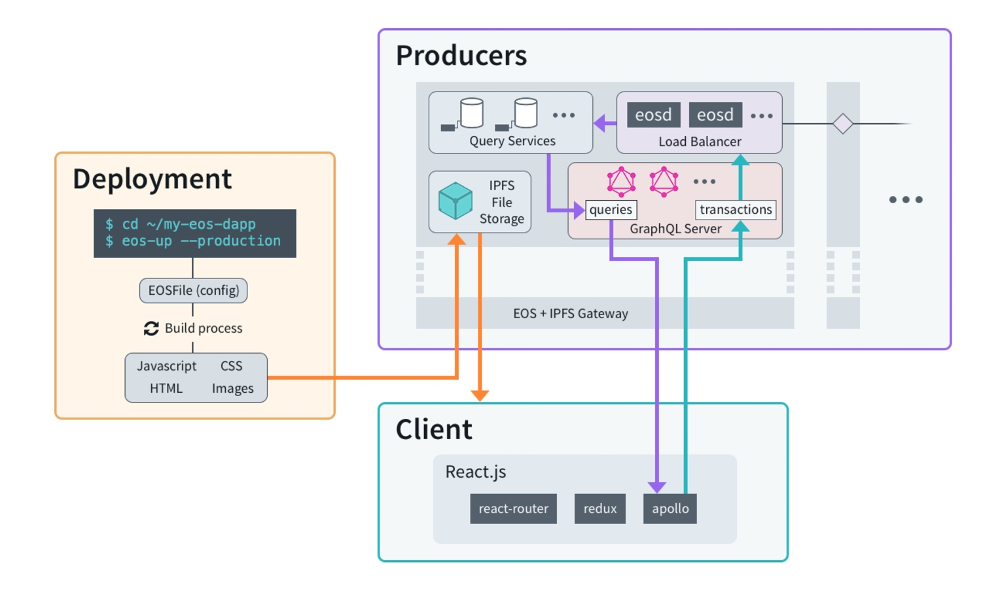

# Introducing EOS.IO Application Stack EOS.IO应用栈介绍

> 原文链接：https://steemit.com/eos/@eosio/introducing-eos-io-application-stack
> 
> 译者：gumoon
> 
> 翻译时间：2017-09-17

After three years of experience with BitShares and Steem, it has become abundantly clear that developing decentralized applications requires much more than a fast blockchain. It also requires infrastructure capable of offering a usable experience to millions of concurrent users. In the early days of steemit.com, users were expected to provide their own image hosting. This made the interface difficult to use and prone to broken images.

过去三年，开发 BitShares 和 Steem 的经验，十分清楚的表明，开发去中心化的应用程序要求的远不止一个快速的区块链。它也要求有能做到百万级并发的互联网基础设施架构能力的可用经验。
在 steemit.com 早期，用户被期待去提供他们自己的图片主机。但这使得接口难于使用并且易于破坏图片。

With the EOS.IO software, we, at block.one, envision a world where block producers provide general purpose infrastructure that allows developers to build and deploy their applications without having to run any servers themselves. This includes applications as complex as steemit, DTube, and decentralized exchanges.

我们，在 block.one，预想世界各地区块链生产者使用 EOS.IO 软件提供通用目的的基础设施，它允许开发者在没有运行他们自己的服务器的情况下，去构建和部署他们的应用程序。这些应用像 [steemit](https://steemit.com/), [DTube](https://dtube.video/) 和 [去中心化的交易所](https://bitshares.org/)一样复杂。

## EOS.IO Storage EOS.IO 存储

EOS.IO Storage is a decentralized file system designed to give everyone in the world with Internet access the ability to permanently store and host legal files which are accessible by any browser. Unlike current alternatives, there are no fees for storage or bandwidth on EOS.IO Storage. Built on IPFS, EOS.IO Storage is a service provided by block producers for those who hold a blockchain’s native tokens. EOS.IO block producers will replicate and host token-holders’ files on the IPFS network as well as provide https endpoints allowing anyone with a browser to access the files.

EOS.IO 存储是一个去中心化化的文件系统，被设计为为世界上的每一个人提供通过互联网访问永久存储的能力，并且托管可以通过浏览器访问的合法文件。跟当下的其它解决方案不同，EOS.IO 存储没有存储和带宽费用。EOS.IO 存储基于 IPFS，由区块生产者为持有区块链原生代币的用户提供。EOS.IO 区块生产者不但将在 IPFS 网络之上复制和托管代币持有者的文件，而且提供 https endpoints，以允许任何人通过浏览器来访问这些文件。

Collectively the producers will reach consensus on how much storage they are willing to provide in exchange for their compensation (block rewards). Block producers who offer more storage for the same reward are likely to earn more votes from token holders.

全体生产者将在多少存储交换多少补偿（区块奖励）上达成一致。区块生产者可以为相同的奖励提供更多的存储来从代币持有者处换取更多的投票权。

More information on EOS.IO Storage will be provided in a future update.

关于 EOS.IO 存储的更多信息将在将来的更新中提供。

## EOS.IO Query Services EOS.IO 查询服务

In addition to hosting files, block producers will be expected to run API nodes that are able to query the blockchain database state on behalf of applications. These APIs will likely be a combination of Graph QL and custom Web Assembly based queries. This makes it trivial for applications to get the information they need without having to run and maintain their own scalable hosting services.

除了托管文件，区块生产者被期待去运行 API 节点。节点协助应用程序查询区块链数据库的状态。这些 API 可以是 Graphp QL 集合，也可以是自定义的 Web Assembly 查询。这使得应用程序可以轻易获得他们需要的信息，而不需要运行和维护他们自己的可扩展的托管服务。

block.one will design and publish open source micro-services that block producers can deploy to map the blockchain database state into more traditional databases for the purpose of scaling read access, maintainability, and additional indexing. This software will facilitate application developers and block producers to build web applications that interact with traditional database APIs.

block.one 将设计并发布开源的微服务。区块生产者可以部署它们，来映射区块链数据库状态到传统数据库，以扩展读请求、可维护性、和额外的索引。EOS软件将加快应用程序开发者和区块生产者构建与传统数据库接口交互的web应用程序。

## Resource Limits 资源限制

Applications consume bandwidth, computation, and storage both on the blockchain and for the interface. Block producers will necessarily have to rate limit access to prevent abuse. This is accomplished for file downloading and API queries the same way bandwidth and CPU time is measured for blockchain updates. Users who hold a small amount of native tokens in a staking contract should be able to have a reasonable level of free access to most applications.

应用程序消耗区块链和接口的带宽、计算力和存储。区块生产者将有必要做访问速率限制来阻止资源滥用。速率限制应用于文件下载和API查询，以相同的方式测量区块链更新的带宽和CPU时间。持有桩合约少量原生代币的用户应该能有一个免费访问大多数应用程序的合理等级。

The usage model will support balancing resource usage billing to either the individual users downloading the file or to the individual who uploaded it in the first place. This mirrors the model where websites pay to provide hosting but adds the flexibility of transparently moving the bill and rate limiting to the users who ultimately have control over their consumption. This is critical for bandwidth intensive applications like dtube.com .

使用模型将支持平衡下载文件的独立用户和首次上传资源的独立用户之间的资源使用账单。提供托管服务的网站付费购买的模型镜像，添加了方便网站管理员透明地删除账单和速率限制的便利。这对带宽敏感的应用程序（像 dtube.com ）来说非常关键。

## Custom Application Infrastructure 自定义应用程序基础设施

block.one recognizes that there are limits to what kind of applications can be built using the general purpose infrastructure provided by block producers. Specifically, applications that require server-side rendering (e.g., steemit) or that require custom database indices maintained by custom micro-services (e.g., market history) may require custom server infrastructure hosted by the application developer or other parties. Developers of these applications can benefit from the same scalable architecture used by block producers to deploy their own customized API and Query Services. This will help developers rapidly bring scalable application infrastructure to market.

block.on 识别出其中的限制：哪种类型的应用程序可以使用区块生产者提供的通用目的基础设施来构建。特别地，要求服务端渲染（如：steemit) 或者要求有由自定义微服务维护的自定义数据库索引（如：市场历史记录）可能要求应用开发者或其他方，托管自定义服务器基础设施。这些应用的开发者可以从区块生产者使用的相同的可扩展架构中受益来部署他们自己的自定义 API 和查询服务。这将帮助开发者快速开发出市场上需要的可扩展的应用程序基础设施。

