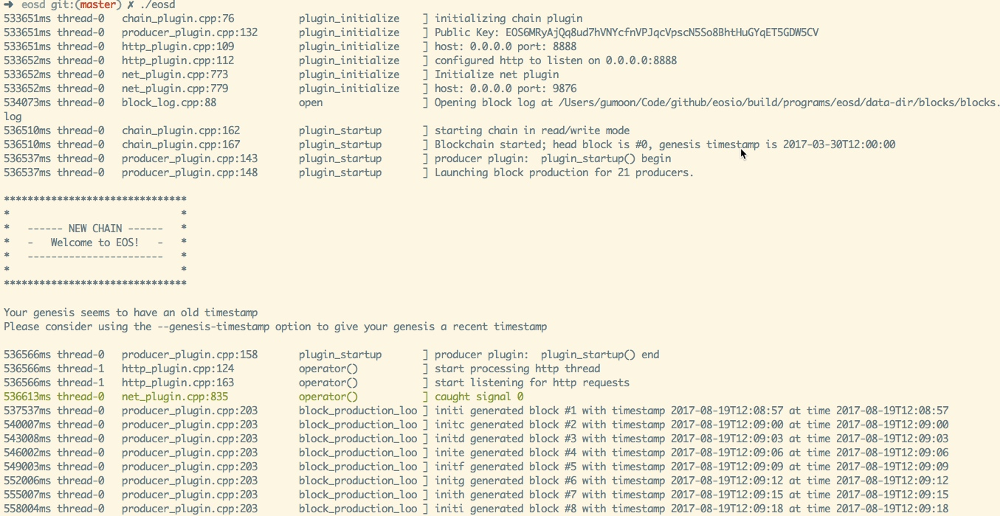

# 在 Mac 机器上源码编译运行 EOS

>参考文档：<https://github.com/EOSIO/eos/blob/master/README.md>

[toc]

## 本文目标

获取 eos 源码，构建并且运行一个简单的能出块的测试网络。

## 第一步：搭建构建/开发环境

因为项目使用 C++14 开发，并且使用 CMake 来编译。所以，推荐安装最新版的 C++ 工具链。
(如果没有安装 Xcode，请先安装 Xcode，Xcode默认会安装c++编译器）

```
brew install autoconf automake m4
brew install cmake
```

EOS 项目依赖一些外部库，必须确保它们已经安装在你的机器上。

```
brew install boost
brew install openssl
brew install llvm
```

安装 secp256k1-zkp:

```
git clone https://github.com/cryptonomex/secp256k1-zkp.git
cd secp256k1-zkp
./autogen.sh
./configure
make
sudo make install
```

## 第二步：从 GitHub 上拉取 EOS 源码

EOS源码包含子模块，所以需要增加 `--recursive` 参数：

```
git clone https://github.com/eosio/eos --recursive
```

如果你克隆时没有使用 `--recursive` 参数，则在代码库执行一下以下命令：

```
git submodule update --init --recursive
```

## 第三步：为 WASM 编译特定的 LLVM 和 clang
**WASM 被用于编译智能合约。**

我们已经安装过 LLVM 和 clang。但是默认版不包含 WASM target 。所以，我们不得不自己编译一个带 WASM 的 LLVM 和 clang。

以下命令创建一个只包含 WASM target 的 LLVM 和 clang。

```
mkdir  ~/wasm-compiler
cd ~/wasm-compiler
git clone --depth 1 --single-branch --branch release_40 https://github.com/llvm-mirror/llvm.git
cd llvm/tools
git clone --depth 1 --single-branch --branch release_40 https://github.com/llvm-mirror/clang.git
cd ..
mkdir build
cd build
cmake -G "Unix Makefiles" -DCMAKE_INSTALL_PREFIX=.. -DLLVM_TARGETS_TO_BUILD= -DLLVM_EXPERIMENTAL_TARGETS_TO_BUILD=WebAssembly -DCMAKE_BUILD_TYPE=Release ../
make -j4 install
```

## 第四步：配置并构建 EOS
因为 ``brew`` 安装的包的类库文件和头文件不在系统默认的 ``include`` 和 ``lib`` 目录。故需要导入一些环境变量，确保编译的时候能找到对应的类库目录。
如果要在本机开发的话，建议将这些环境变量加到 ``.zshrc`` 文件中。

```
export BOOST_ROOT=/usr/local/opt/boost
export LLVM_DIR=/usr/local/opt/llvm
export OPENSSL_ROOT_DIR=/usr/local/opt/openssl
export WASM_LLVM_CONFIG=~/wasm-compiler/llvm/bin/llvm-config
```

现在可以构建了：

```
cd /path/to/eos/source
mkdir -p build && cd build
cmake -DCMAKE_BUILD_TYPE=Debug ..
make -j4
```

构建完成后，可以进行测试：(也可以省略这一步）

```
cd tests
./chain_test
```

## 第五步：创建并运行一个单节点测试网络

构建完成后，你可以在 `programs/eosd` 目录下找到 `eosd` 二进制文件。

首次运行 `eosd` 将会失败，同时会在当前目录下创建一个叫 `data-dir` 的数据存储目录。这个目录会包含一个 ``config.ini`` 的配置文件。

如果你不想把数据存储目录放在当前目录，在运行 ``eosd`` 时，可以指定 `--data-dir /path/to/data`。

现在编辑 ``config.ini`` 文件，在文件末尾添加以下设置。（注意，*相同的设置项，请注释掉之前的默认值*）

```
# Load the testnet genesis state, which creates some initial block producers with the default key
# 这些配置为你的 eos 根目录的 genesis.json 
genesis-json = /path/to/eos/source/genesis.json 
# Enable production on a stale chain, since a single-node test chain is pretty much always stale
enable-stale-production = true
# Enable block production with the testnet producers
producer-name = inita
producer-name = initb
producer-name = initc
producer-name = initd
producer-name = inite
producer-name = initf
producer-name = initg
producer-name = inith
producer-name = initi
producer-name = initj
producer-name = initk
producer-name = initl
producer-name = initm
producer-name = initn
producer-name = inito
producer-name = initp
producer-name = initq
producer-name = initr
producer-name = inits
producer-name = initt
producer-name = initu
# Load the block producer plugin, so we can produce blocks
plugin = eos::producer_plugin
```

如果你的电脑空余硬盘不足8G，请求修改 ``shared-file-size`` 项，为一个较小的值，例如：512。当硬盘不足时，可能运行不成功。

再次运行 `eosd`, 将看到开始出块了。[^footnote]

上图😁



[^footnote]: 当前，P2P 功能代码还没有实现，所以，只能运行单节点。


